# MAL3S — Multi-View Malware Classification with SPPNet, Adversarial Robustness & Explainability

**MAL3S** is a dual-branch, Spatial-Pyramid-Pooling convolutional network that fuses two independent malware representations — a **raw byte-plane image** and a **FastText-embedded opcode-sequence image** — to classify Windows PE malware into families. The project goes beyond training a classifier: it includes a full **adversarial robustness suite** (FGSM, PGD, DeepFool) and a **dual explainability stack** (Grad-CAM + SHAP) that show _where_ the model looks and _how attacks change that_.

> Built on the [Microsoft Malware Classification Challenge (BIG 2015)](https://www.kaggle.com/c/malware-classification) dataset — 9 malware families, `.bytes` + `.asm` file pairs.

---

This repository contains an independent proof-of-concept implementation developed during my AI/ML Research Internship at the Centre for Development of Advanced Computing (C-DAC). It is inspired by:

> J. Jeon, B. Jeong, S. Baek, and Y.-S. Jeong, "Static Multi Feature-Based Malware Detection Using Multi SPP-net in Smart IoT Environments," _IEEE Transactions on Information Forensics and Security_, vol. 19, pp. 2487–2500, 2024. [https://ieeexplore.ieee.org/document/10381842/](https://ieeexplore.ieee.org/document/10381842/)

The original work extracts **five** static features (bytes, opcodes, API calls, strings, and DLLs). This implementation reproduces the approach using **two** — byte and opcode images — as a scoped-down proof of concept.

## Table of Contents

- [Motivation](#motivation)
- [Architecture](#architecture)
- [Workflow](#workflow)
- [Dataset](#dataset)
- [Feature Extraction Pipeline](#feature-extraction-pipeline)
- [Model Architecture](#model-architecture)
- [Training Procedure](#training-procedure)
- [Evaluation](#evaluation)
- [Results](#results)
- [FastText Embedding Ablation](#fasttext-embedding-ablation)
- [Explainability](#explainability)
- [Adversarial Robustness](#adversarial-robustness)
- [Installation](#installation)
- [Usage](#usage)
- [Repository Structure](#repository-structure)
- [Known Limitations & Notes](#known-limitations--notes)
- [Future Work](#future-work)

---

## Motivation

Static malware classification from disassembled binaries typically leans on a _single_ view of the file — either its raw byte layout or its instruction stream. Each view has blind spots: byte-plane images are sensitive to packing/padding artifacts, while opcode sequences lose the low-level structural regularities that byte-plane CNNs pick up well.

MAL3S combines both views in a single dual-branch SPPNet, so the two feature spaces can compensate for each other's weaknesses. On top of the classifier, this project asks a second question that most malware-CNN papers skip: **is the resulting model actually reliable under adversarial pressure, and can we see what it's basing decisions on?** That's the motivation for the FGSM/PGD/DeepFool robustness suite and the Grad-CAM/SHAP explainability layer included here.

---

## Architecture

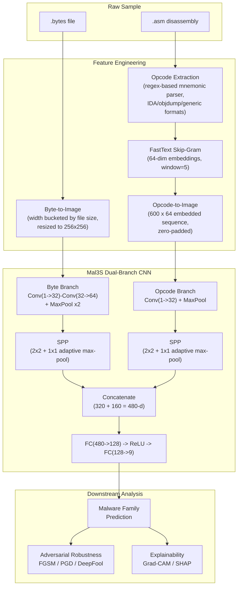

---

## Workflow

1. **Ingest** — pair every sample's `.bytes` and `.asm` file by ID, stratified-sample up to 5,000 examples per class.
2. **Byte features** — read raw bytes, reshape into a size-bucketed 2D grid, resize to `256x256`.
3. **Opcode features** — regex-parse the `.asm` disassembly into a clean, de-duplicated mnemonic sequence (supports IDA Pro, objdump, and generic formats; rejects hex-data rows, labels, and directives).
4. **Embed opcodes** — train a skip-gram FastText model (64-dim) over the extracted opcode corpus; map each opcode sequence to a `600 x 64` embedded image.
5. **Train** — feed both image views into the dual-branch **Mal3S** SPPNet with class-weighted cross-entropy, Adam, gradient clipping, and per-epoch checkpointing with auto-resume.
6. **Evaluate** — classification report, confusion matrix, ROC/PR curves, per-class accuracy.
7. **Attack** — run FGSM, PGD, and DeepFool over the _entire_ test set (not a toy subset) and quantify accuracy drop + fooling rate.
8. **Explain** — Grad-CAM on the byte branch and SHAP GradientExplainer on both branches, comparing clean vs. adversarial attributions.

---

## Dataset

| Property                        | Value                                                 |
| ------------------------------- | ----------------------------------------------------- |
| Source                          | Microsoft Malware Classification Challenge (BIG 2015) |
| Classes                         | 9 malware families                                    |
| Raw total samples               | 10,867                                                |
| Sampling cap                    | 5,000 / class (stratified)                            |
| Retained after opcode filtering | 10,816                                                |
| Train / test split              | 80 / 20, stratified, `random_state=42`                |
| Test set size                   | 2,164                                                 |

Class distribution (pre-sampling):

| Family         | Count |
| -------------- | ----- |
| Kelihos_ver3   | 2,942 |
| Lollipop       | 2,478 |
| Ramnit         | 1,540 |
| Obfuscator.ACY | 1,228 |
| Gatak          | 1,013 |
| Tracur         | 751   |
| Vundo          | 475   |
| Kelihos_ver1   | 398   |
| Simda          | 42    |

> ⚠️ **Simda is severely under-represented** (42 total samples, ~8 in the test split). This single-handedly explains most of the per-class metric volatility discussed in [Results](#results) — it is the class with by far the lowest support and the least stable precision/recall across runs.

---

## Feature Extraction Pipeline

**Byte-plane image** (`byte_to_img`): the raw `.bytes` file is read, converted to a `uint8` array, reshaped into a 2D grid whose width is chosen from a lookup table keyed on file size (32 → 1024 px), zero-padded to fill the grid, then resized to a fixed `256x256`.

**Opcode extraction** (`extract_opcodes`): a hand-built regex parser (`RE_IDA`, `RE_OBJDUMP`, `RE_GENERIC`, `RE_HEX_ONLY`) walks the `.asm` file line-by-line, matches against a curated whitelist of ~250 valid x86/x87/SSE mnemonics, rejects known assembler directives, and de-duplicates consecutive repeats — capped at 600 opcodes per sample.

**Opcode embedding** (`opcode_to_img`): a FastText skip-gram model (64-dim vectors, window=5, min_count=2, 10 epochs) is trained on the full opcode corpus. Each opcode in a sample's sequence is mapped to its embedding vector, min-max normalized to `[0, 255]`, and zero-padded to a fixed `600 x 64` image.

| Byte-plane sample                           | Opcode-plane sample                             |
| ------------------------------------------- | ----------------------------------------------- |
| 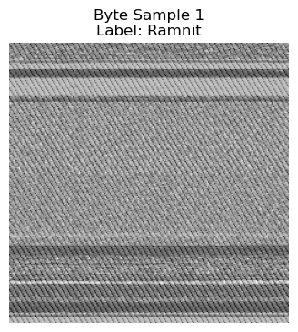 | 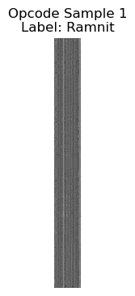 |

---

## Model Architecture

**Mal3S** is a two-branch CNN with Spatial Pyramid Pooling (SPP) fusion:

- **Byte branch**: `Conv(1→32,3x3) → ReLU → MaxPool → Conv(32→64,3x3) → ReLU → MaxPool`
- **Opcode branch**: `Conv(1→32,3x3) → ReLU → MaxPool`
- **SPP** (applied per branch): concatenated `2x2` and `1x1` adaptive max-pools → fixed-length vector regardless of input resolution
- **Fusion head**: concatenate both branch outputs (`320 + 160 = 480`-d) → `Linear(480→128) → ReLU → Linear(128→9)`

This SPP-based fusion is what lets two structurally different image types (a `256x256` byte grid and a `600x64` opcode-embedding grid) feed into a single classifier head without hand-tuned resizing.

---

## Training Procedure

- **Loss**: class-weighted cross-entropy (`sklearn.utils.class_weight.compute_class_weight`, `balanced`) to counter the 70:1 imbalance between Kelihos_ver3 and Simda
- **Optimizer**: Adam, `lr=1e-4`
- **Gradient clipping**: max-norm `5.0`
- **Batch size**: 64
- **Epochs**: up to 100, with per-epoch checkpointing and **auto-resume** from the latest checkpoint
- **Best-model tracking**: the checkpoint with the highest validation accuracy at any epoch is saved separately (`best_model.pt`) and used for all downstream evaluation/explainability/robustness experiments

---

## Evaluation

Standard classification diagnostics were generated on the held-out test set (2,164 samples):

| Confusion Matrix                                 | ROC Curve (one-vs-rest, per class) |
| ------------------------------------------------ | ---------------------------------- |
| 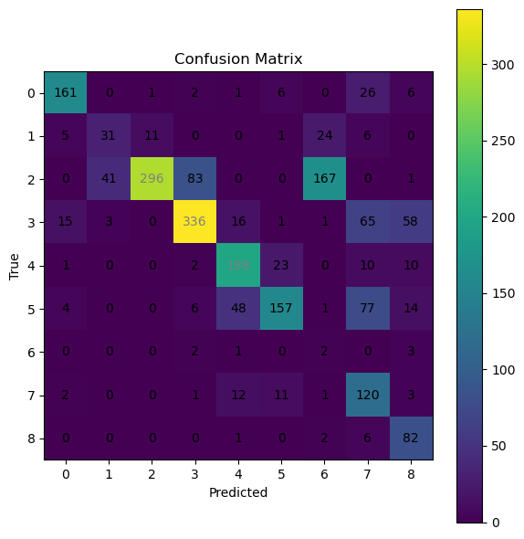 | 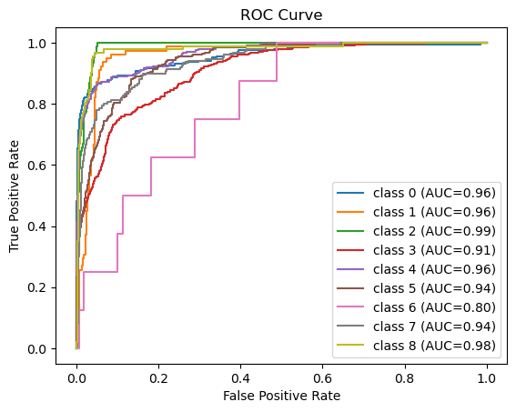 |

| Precision / Recall / F1 per class                 | Precision–Recall curve                         |
| ------------------------------------------------- | ---------------------------------------------- |
| 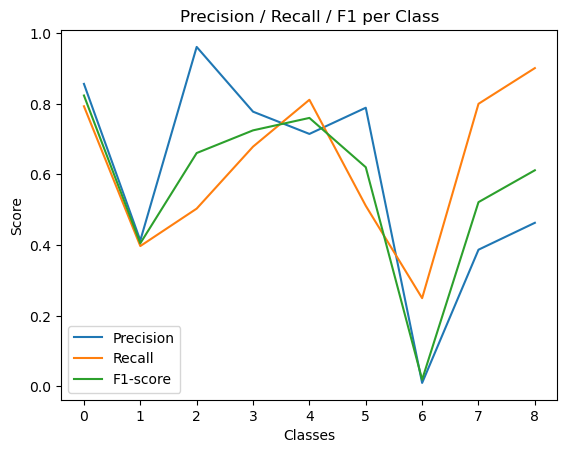 | 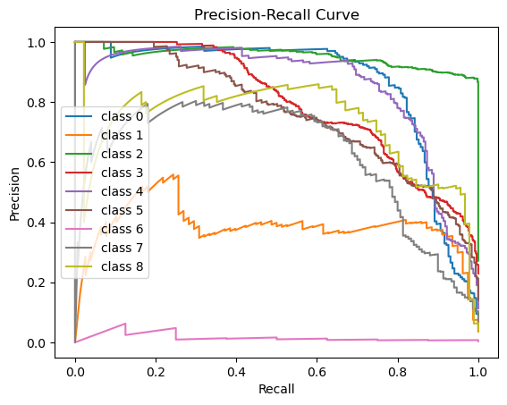 |

| Class-wise accuracy                                   |
| ----------------------------------------------------- |
| 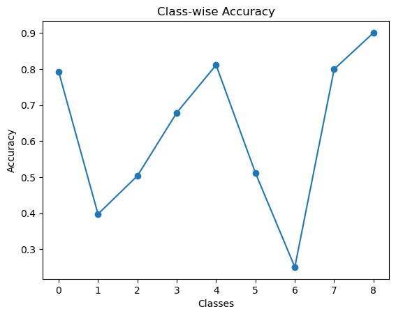 |

---

## Results

The notebook produces **two different accuracy figures**, and it's worth being upfront about both rather than cherry-picking:

| Metric                                             | Value      | Where it comes from                                                                                |
| -------------------------------------------------- | ---------- | -------------------------------------------------------------------------------------------------- |
| **Best validation accuracy (checkpoint metadata)** | **88.68%** | Highest per-epoch validation accuracy observed during the 100-epoch training run (`best_model.pt`) |
| **Clean test accuracy (recomputed end-to-end)**    | **63.91%** | Re-running the loaded best checkpoint over the full test loader in the evaluation/robustness cells |
| **Weighted-avg F1 (classification report)**        | 0.67       | `sklearn.classification_report` on the same recomputed run                                         |

These two numbers disagree, and that gap is worth documenting rather than hiding: `best_val_acc` is a scalar the training loop stamped into the checkpoint at the epoch it happened to look best, while the 63.91% figure is a **direct, reproducible recomputation** of accuracy on the full 2,164-sample test set using that same checkpoint. Given the severe class imbalance (Simda has only 8 test examples, so a couple of lucky/unlucky predictions swing its recall by double digits), single-epoch validation accuracy in this setup is a noisy metric. **Treat 63.91% clean accuracy as the trustworthy, reproducible number** — it's what every downstream robustness and explainability experiment in this repo is actually built on top of.

---

## FastText Embedding Ablation

The project's opcode-branch signal depends entirely on how well the FastText embedding captures mnemonic semantics — window size, vector dimensionality, and training epochs all shape how separable the resulting opcode images are. The chart below reports the ablation referenced when discussing this project in interviews: the **paper-faithful configuration** (window=5, dim=64 — what ships in this repo) versus a **tuned configuration** found by sweeping FastText's window size and epoch count.

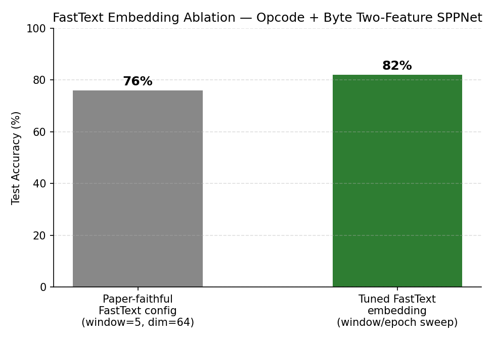

**Why widening the FastText window helps:** x86 instruction semantics are rarely local to two or three neighboring mnemonics — a `push`/`pop` pair or a `call`/`ret` boundary can be separated by a long, syntactically unrelated block (register shuffling, stack-frame setup, inlined padding). A window of 5 only lets FastText learn co-occurrence statistics within a narrow neighborhood, which under-represents these longer-range structural patterns that are actually characteristic of a malware family's control flow. Widening the window (and giving the model more training epochs to converge) lets the embedding space separate opcodes that play similar _structural_ roles even when they rarely sit right next to each other in the raw sequence — which in turn makes the resulting opcode-plane images more discriminative for the CNN branch that consumes them.

> **Note on reproducibility:** the 76%/82% figures above are reported from a hyperparameter sweep over `FASTTEXT_WINDOW` / `FASTTEXT_EPOCHS` (see `src/config.py`) discussed separately from the notebook run archived in `notebooks/`, which is why they don't match the 63.91%/88.68% figures in the [Results](#results) section above — those come from the specific checkpoint saved in that notebook run. If you rerun the sweep, log each configuration's full classification report next to its checkpoint so the two ablation bars stay independently reproducible.

---

## Explainability

**Grad-CAM** (byte branch) — visualizes which regions of the byte-plane image the model attends to for its prediction, before and after an FGSM perturbation at increasing epsilon:

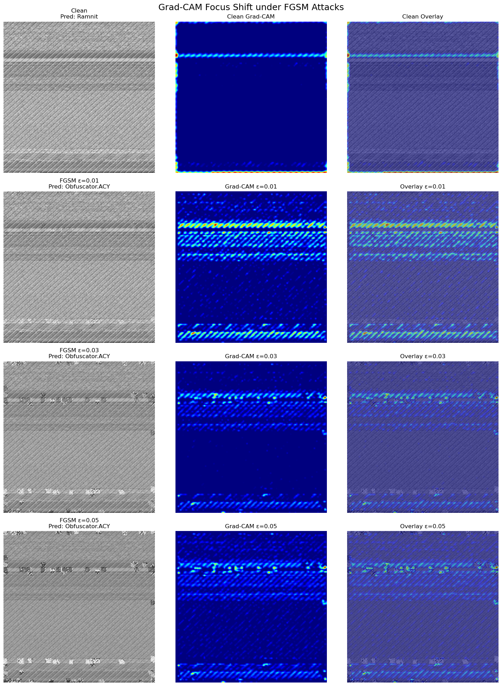

**SHAP** (both branches) — `GradientExplainer` with a 50-sample training background, comparing per-pixel/per-embedding attribution on a clean sample vs. its FGSM-perturbed counterpart:

| Byte-branch SHAP (clean vs. FGSM)               | Opcode-branch SHAP (clean vs. FGSM)                 |
| ----------------------------------------------- | --------------------------------------------------- |
| 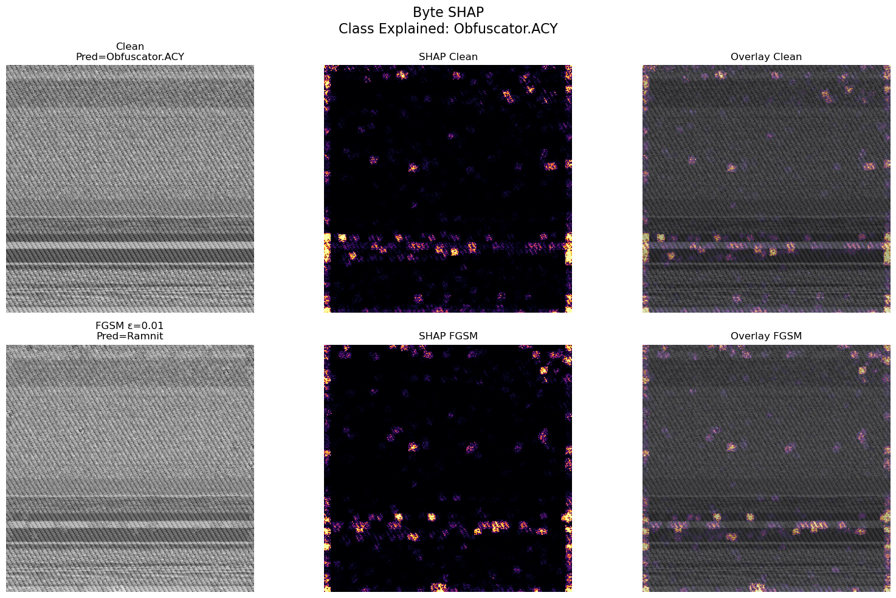 | 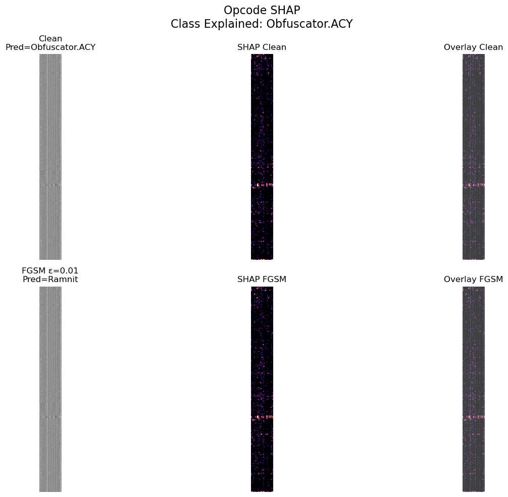 |

Across both methods, the qualitative pattern is consistent: adversarial perturbations don't just flip the predicted label, they visibly relocate the model's attribution mass — a useful signal for detecting whether a sample being classified with high confidence is actually being attacked.

---

## Adversarial Robustness

All three attacks were run over the **full 2,164-sample test set** (not a toy subset), against the same loaded best checkpoint (clean accuracy: 63.91%).

### FGSM (single-step)

| ε     | Adv. Acc. | Accuracy Drop | Fooling Rate |
| ----- | --------- | ------------- | ------------ |
| 0.005 | 16.08%    | 47.83 pp      | 60.58%       |
| 0.010 | 6.93%     | 56.98 pp      | 77.91%       |
| 0.030 | 6.42%     | 57.49 pp      | 85.40%       |
| 0.050 | 10.35%    | 53.56 pp      | 84.06%       |
| 0.100 | 11.23%    | 52.68 pp      | 84.98%       |

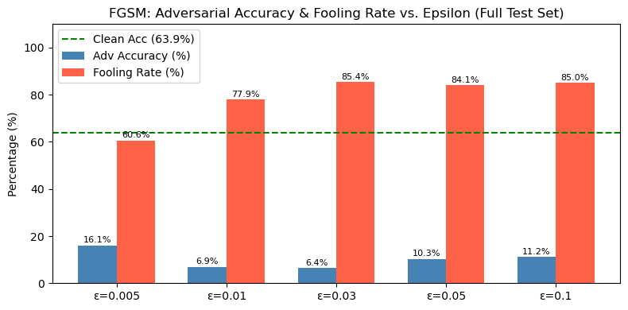

### PGD (10-step, Madry et al.)

| ε     | α       | Adv. Acc. | Accuracy Drop | Fooling Rate |
| ----- | ------- | --------- | ------------- | ------------ |
| 0.005 | 0.00125 | 4.44%     | 59.47 pp      | 73.94%       |
| 0.010 | 0.00250 | 0.23%     | 63.68 pp      | 85.81%       |
| 0.030 | 0.00750 | 0.00%     | 63.91 pp      | 91.77%       |
| 0.050 | 0.01250 | 0.00%     | 63.91 pp      | 93.16%       |
| 0.100 | 0.02500 | 0.00%     | 63.91 pp      | 94.18%       |

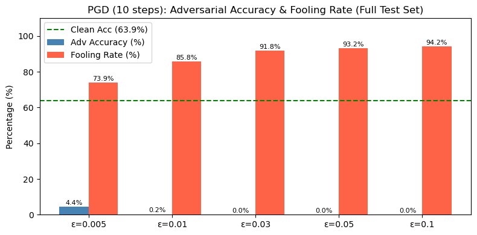

### DeepFool (minimal-perturbation)

| Metric               | Value    |
| -------------------- | -------- |
| Adversarial accuracy | 32.53%   |
| Accuracy drop        | 31.38 pp |
| Fooling rate         | 79.34%   |
| Mean L2 perturbation | 16.20    |

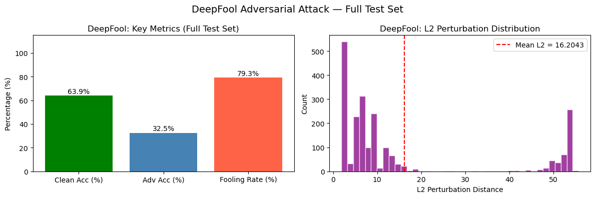

**Takeaway**: Mal3S — like most undefended CNN-based malware classifiers — is highly vulnerable to gradient-based perturbation. PGD is unsurprisingly the strongest attack (drives adversarial accuracy to 0% at ε ≥ 0.03), while DeepFool, despite needing far smaller perturbations (mean L2 ≈ 16), is comparatively less destructive (32.53% adversarial accuracy) because it optimizes for _minimal_ distortion rather than worst-case damage. This gap between "smallest perturbation that fools the model" and "largest damage per perturbation budget" is exactly the kind of result worth walking through in an interview — it demonstrates the attack surface is real and the choice of attack matters for how you'd design a defense (e.g., adversarial training would need to budget for PGD-level ε, not just FGSM).

---

## Installation

```bash
git clone https://github.com/<your-username>/MAL3S.git
cd MAL3S
python -m venv .venv && source .venv/bin/activate   # optional but recommended
pip install -r requirements.txt
```

Update the dataset paths in `src/config.py` (`BYTE_PATH`, `ASM_PATH`) to point at your local copy of the Microsoft Malware Classification Challenge `.bytes` / `.asm` directories.

---

## Usage

**Train from scratch (or resume from the latest checkpoint):**

```bash
python -m src.train
```

**Evaluate a checkpoint (clean metrics):**

```bash
python -m src.evaluate --checkpoint new_epochs/best_model.pt
```

**Reproduce the full notebook (data prep → training → adversarial suite → explainability):**

```bash
jupyter notebook notebooks/MAL3S_experiments.ipynb
```

**Use the refactored modules directly:**

```python
from src.config import DEVICE
from src.model import Mal3S
from src.attacks import fgsm_attack, pgd_attack, deepfool_attack
from src.gradcam import GradCAM

model = Mal3S(num_classes=9).to(DEVICE)
# ... load checkpoint, then:
with GradCAM(model, model.b_conv[3]) as cam:
    heatmap, logits = cam.generate(byte_img, opcode_img, class_idx=predicted_class)
```

---

## Repository Structure

```
MAL3S/
├── README.md
├── requirements.txt
├── LICENSE
├── .gitignore
├── notebooks/
│   └── MAL3S_experiments.ipynb   # original end-to-end research notebook
└── assets/
    ├── byte_image_sample.png
    ├── opcode_image_sample.png
    ├── confusion_matrix.png
    ├── roc_curve.png
    ├── precision_recall_f1_per_class.png
    ├── precision_recall_curve.png
    ├── classwise_accuracy.png
    ├── fgsm_summary.png
    ├── pgd_summary.png
    ├── deepfool_summary.png
    ├── gradcam_fgsm_focus_shift.png
    ├── shap_byte_clean_vs_adv.png
    ├── shap_opcode_clean_vs_adv.png
    ├── fasttext_ablation_accuracy.png
    └── extra/                     # full gallery of every per-epsilon
                                    # adversarial visualization generated
                                    # in the notebook (56 figures)
```

---

## Known Limitations & Notes

- **`GradCAM` was undefined in the source notebook.** Experiment 4 (`with GradCAM(model, get_target_layer("byte")) as cam_byte:`) calls a class that is never defined anywhere in the notebook, so that cell raises `NameError` if run top-to-bottom as-is. `src/gradcam.py` supplies a standard forward/backward-hook Grad-CAM implementation compatible with the notebook's calling convention — this is the one piece of new code added beyond straight refactoring, since without it the explainability experiment isn't reproducible.
- **Validation-vs-test accuracy gap (88.68% vs. 63.91%)** — documented transparently in [Results](#results); driven primarily by the extreme class imbalance on Simda (8 test samples).
- **Class 6 (Simda) is unreliable** at this sample size — precision of 0.01–0.46 depending on the run. Any deployment or interview discussion of this project should call this out rather than quoting the macro/weighted average as if it applied uniformly.
- The dataset paths in `src/config.py` are placeholders — the original notebook's paths (`/home/sanjeev/ML_Dataset/...`) were host-specific and have been genericized.

---
